# Fabric Data Flow Analysis

## Executive Overview

### High-Level System Architecture

```mermaid
graph TB
    subgraph "External Inputs"
        CLI[CLI Interface]
        WebUI[Web UI]
        REST[REST API Clients]
        Ollama[Ollama API Clients]
    end

    subgraph "Fabric Core System"
        Registry[PluginRegistry]
        Vendors[Vendor Manager]
        Patterns[Patterns Entity]
        Sessions[Sessions Entity]
        Contexts[Contexts Entity]
        Chatter[Chatter Orchestrator]
    end

    subgraph "AI Provider Layer"
        OpenAI[OpenAI Provider]
        Anthropic[Anthropic Provider]
        Gemini[Google Gemini]
        OllamaProv[Ollama Provider]
        Azure[Azure OpenAI]
        Bedrock[Amazon Bedrock]
        Vertex[Vertex AI]
        Perplexity[Perplexity AI]
        LMStudio[LM Studio]
        Exolab[Exolab]
    end

    subgraph "External Integrations"
        YouTube[YouTube API]
        Jina[Jina AI Scraper]
        GitHelper[Git Helper]
        TemplateExts[Template Extensions]
    end

    subgraph "Data Storage"
        FileSystem[File System Storage]
        EnvFile[.env Configuration]
        PatternsDir[Patterns Directory]
        SessionsDir[Sessions Directory]
        ContextsDir[Contexts Directory]
        CustomPatterns[Custom Patterns Directory]
    end

    subgraph "Output Destinations"
        Stdout[Standard Output]
        Clipboard[Clipboard]
        Files[Output Files]
        SSE[Server-Sent Events]
        Notifications[Desktop Notifications]
    end

    CLI --> Registry
    WebUI --> REST
    REST --> Registry
    Ollama --> REST

    Registry --> Vendors
    Registry --> Patterns
    Registry --> Sessions
    Registry --> Contexts
    Registry --> Chatter

    Chatter --> Vendors
    Vendors --> OpenAI
    Vendors --> Anthropic
    Vendors --> Gemini
    Vendors --> OllamaProv
    Vendors --> Azure
    Vendors --> Bedrock
    Vendors --> Vertex
    Vendors --> Perplexity
    Vendors --> LMStudio
    Vendors --> Exolab

    Chatter --> YouTube
    Chatter --> Jina
    Chatter --> GitHelper
    Chatter --> TemplateExts

    Patterns --> FileSystem
    Sessions --> FileSystem
    Contexts --> FileSystem
    Registry --> EnvFile

    FileSystem --> PatternsDir
    FileSystem --> SessionsDir
    FileSystem --> ContextsDir
    FileSystem --> CustomPatterns

    Chatter --> Stdout
    Chatter --> Clipboard
    Chatter --> Files
    Chatter --> SSE
    Chatter --> Notifications

    OpenAI --> OpenAI_API[OpenAI API]
    Anthropic --> Anthropic_API[Anthropic API]
    Gemini --> Gemini_API[Google Gemini API]
    Azure --> Azure_API[Azure API]
    Bedrock --> Bedrock_API[AWS Bedrock API]
    Vertex --> Vertex_API[Vertex AI API]
    Perplexity --> Perplexity_API[Perplexity API]
    OllamaProv --> Ollama_API[Ollama API]

    YouTube --> YouTube_API[YouTube Data API v3]
    Jina --> Jina_API[Jina AI API]
```

### Core System Components

1. **PluginRegistry**: Central orchestration hub that manages all plugins, vendors, and tools
2. **VendorsManager**: Manages AI provider selection and model availability
3. **Storage Entities**: File-based database for patterns, sessions, and contexts
4. **Chatter**: Main chat orchestration component handling request/response flow
5. **Tool Integrations**: YouTube, Jina, Git helpers for data ingestion
6. **REST API**: Gin-based HTTP server with SSE streaming support
7. **CLI Interface**: Command-line interface using Cobra framework

### Data Flow Overview

Fabric follows a plugin-based architecture where:

1. **Input Processing**: User input (text, files, URLs, YouTube links) is processed by tools
2. **Pattern Application**: Selected patterns/templates are loaded and variable substitution applied
3. **Context Injection**: Optional context files are pre-pended to build conversation history
4. **Session Management**: Multi-turn conversations maintained via session storage
5. **Vendor Routing**: Request routed to appropriate AI provider based on model selection
6. **Response Processing**: AI responses processed (streaming, thinking blocks, file changes)
7. **Output Delivery**: Results delivered via CLI, clipboard, files, or API streaming

---

## Domain Models and Database Schema

### File-Based Storage Architecture

Fabric uses a file-system based database pattern rather than traditional relational databases:

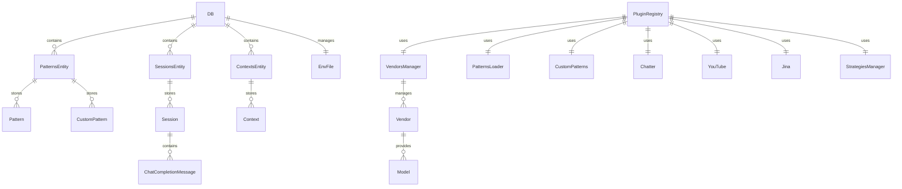

### Core Domain Entities

#### 1. ChatCompletionMessage

```go
type ChatCompletionMessage struct {
    Role             string              // "system", "user", "assistant", "function", "tool", "developer", "meta"
    Content          string              // Text content
    Refusal          string              // Optional refusal message
    MultiContent     []ChatMessagePart   // Multi-modal content (text + images)
    Name             string              // Optional message name
    ReasoningContent string              // Extended thinking/reasoning content
    FunctionCall     *FunctionCall       // Optional function call
    ToolCalls        []ToolCall         // Optional tool calls
    ToolCallID       string              // Optional tool call ID
}

type ChatMessagePart struct {
    Type     ChatMessagePartType   // "text" or "image_url"
    Text     string               // Text content
    ImageURL *ChatMessageImageURL // Image URL with optional detail level
}

type ChatMessageImageURL struct {
    URL string // Image URL or base64 data URI
}

type FunctionCall struct {
    Name      string // Function name
    Arguments string // Function arguments as JSON string
}

type ToolCall struct {
    Index    *int         // Tool index in array
    ID       string       // Tool call identifier
    Type     ToolType     // "function"
    Function FunctionCall  // Function to call
}
```

#### 2. ChatRequest

```go
type ChatRequest struct {
    ContextName           string              // Optional context name to inject
    SessionName           string              // Optional session name for multi-turn
    PatternName           string              // Pattern/template name
    PatternVariables      map[string]string  // Variables for template substitution
    Message              *ChatCompletionMessage // User message
    Language              string              // Language code (e.g., "en", "zh")
    Meta                  string              // Metadata message
    InputHasVars          bool                // Whether input contains template variables
    NoVariableReplacement bool                // Skip variable replacement
    StrategyName          string              // Prompt strategy name
}
```

#### 3. ChatOptions

```go
type ChatOptions struct {
    Model               string              // Model name (e.g., "gpt-4", "claude-3-5-sonnet")
    Temperature         float64             // Sampling temperature (0.0-2.0, default 0.7)
    TopP                float64             // Nucleus sampling (0.0-1.0, default 0.9)
    PresencePenalty     float64             // Penalty for new topics (default 0.0)
    FrequencyPenalty    float64             // Penalty for repetition (default 0.0)
    Raw                 bool                // Use raw mode without chat options
    Seed                int                 // Sampling seed for deterministic output
    Thinking            ThinkingLevel        // AI reasoning/thinking level
    ModelContextLength  int                 // Context window size in tokens
    MaxTokens           int                 // Maximum tokens in response
    Search              bool                // Enable web search (OpenAI, Gemini, Anthropic)
    SearchLocation      string              // Location for search results
    ImageFile           string              // Generated image output path
    ImageSize           string              // Image dimensions (e.g., "1024x1024")
    ImageQuality        string              // Image quality (low, medium, high, auto)
    ImageCompression    int                 // JPEG/WebP compression (0-100)
    ImageBackground     string              // Background type (opaque, transparent)
    SuppressThink       bool                // Remove thinking blocks from output
    ThinkStartTag       string              // Start tag for thinking sections (default: <thinking>)
    ThinkEndTag         string              // End tag for thinking sections (default: </thinking>)
    AudioOutput         bool                // Enable text-to-speech output
    AudioFormat         string              // Audio format for TTS
    Voice               string              // TTS voice name (e.g., "Kore", "Charon")
    Notification        bool                // Send desktop notification on completion
    NotificationCommand string              // Custom notification command
    ShowMetadata        bool                // Display token usage metadata
    Quiet               bool                // Suppress output
    UpdateChan          chan StreamUpdate   // Channel for streaming updates
}
```

#### 4. StreamUpdate

```go
type StreamUpdate struct {
    Type    string          // "content", "usage", "error"
    Content string          // Stream content or error message
    Usage   *UsageMetadata // Token usage information
}

type UsageMetadata struct {
    InputTokens  int // Prompt tokens
    OutputTokens int // Completion tokens
    TotalTokens  int // Total tokens
}
```

#### 5. Attachment

```go
type Attachment struct {
    Type    *string  // MIME type (e.g., "image/png")
    Path    *string  // Local file path
    URL     *string  // Remote URL
    Content []byte   // Raw content bytes
    ID      *string  // SHA256 hash identifier
}
```

#### 6. Pattern

```go
type Pattern struct {
    Name        string // Pattern name (directory name)
    Description string // Optional description
    Pattern     string // Pattern content with {{input}} placeholder and template variables
}
```

#### 7. Session

```go
type Session struct {
    Name             string                     // Session name (filename without .json)
    Messages         []*ChatCompletionMessage   // Conversation history
    vendorMessages   []*ChatCompletionMessage   // Messages filtered for vendor (excludes "meta" role)
}
```

#### 8. Context

```go
type Context struct {
    Name    string // Context name (filename without .md)
    Content string // Context content (plain text or markdown)
}
```

### Database Schema - File Structure

```
~/.config/fabric/
├── .env                              # Environment variables configuration
├── patterns/                          # Built-in patterns
│   ├── pattern_name_1/
│   │   └── system.md                 # System prompt pattern
│   ├── pattern_name_2/
│   │   └── system.md
│   └── ...
├── sessions/                          # Chat sessions (JSON files)
│   ├── session_1.json
│   ├── session_2.json
│   └── ...
├── contexts/                          # Context files
│   ├── context_1.md
│   ├── context_2.md
│   └── ...
├── strategies/                        # Prompt strategies (JSON files)
│   ├── cot.json                       # Chain-of-Thought
│   ├── cod.json                       # Chain-of-Draft
│   ├── tot.json                       # Tree-of-Thought
│   └── ...
└── extensions/                        # Template extensions
    ├── extension_1.go
    ├── extension_2.go
    └── ...
```

### Environment Variables Schema

```go
// Core Configuration
FABRIC_DEFAULT_MODEL="vendor|model"        // Default model (e.g., "OpenAI|gpt-4")
FABRIC_DEFAULT_MODEL_CONTEXT_LENGTH=2048    // Default context length
FABRIC_MODEL_PATTERN_NAME="vendor|model"    // Per-pattern model mapping

// OpenAI Configuration
OPENAI_API_KEY="sk-..."                // OpenAI API key
OPENAI_API_BASE_URL="https://api.openai.com/v1"  // Custom base URL
OPENAI_DISABLE_RESPONSES_API=false        // Disable Responses API

// Anthropic Configuration
ANTHROPIC_API_KEY="sk-ant-..."        // Anthropic API key
ANTHROPIC_OAUTH_TOKEN="..."           // OAuth token (Max subscription)

// Azure OpenAI Configuration
AZURE_OPENAI_API_KEY="..."            // Azure API key
AZURE_OPENAI_ENDPOINT="https://..."      // Azure endpoint URL
AZURE_OPENAI_API_VERSION="2024-02-15-preview"

// Google Gemini Configuration
GEMINI_API_KEY="..."                  // Google API key
GEMINI_VOICE="Kore"                   // TTS voice selection

// Ollama Configuration
OLLAMA_BASE_URL="http://localhost:11434"  // Ollama server URL

// Amazon Bedrock Configuration
BEDROCK_AWS_REGION="us-east-1"
BEDROCK_AWS_ACCESS_KEY_ID="..."
BEDROCK_AWS_SECRET_ACCESS_KEY="..."

// Vertex AI Configuration
VERTEXAI_PROJECT_ID="..."
VERTEXAI_LOCATION="us-central1"

// Perplexity Configuration
PERPLEXITY_API_KEY="pplx-..."

// YouTube Configuration
YOUTUBE_API_KEY="..."                // YouTube Data API key

// Jina AI Configuration
JINAAI_API_KEY="..."                // Jina AI API key

// Language Configuration
LANGUAGE_DEFAULT_CODE="en"              // Default language code

// Custom Patterns Configuration
CUSTOM_PATTERNS_DIRECTORY="~/my-patterns"  // Custom patterns path

// Patterns Loader Configuration
PATTERNS_LOADER_GITHUB_REPO="danielmiessler/fabric"
PATTERNS_LOADER_GITHUB_BRANCH="main"
PATTERNS_LOADER_PATTERNS_PATH="patterns"
PATTERNS_LOADER_STRATEGIES_PATH="strategies"

// Strategies Loader Configuration
STRATEGIES_LOADER_GITHUB_REPO="danielmiessler/fabric"
STRATEGIES_LOADER_GITHUB_BRANCH="main"
STRATEGIES_LOADER_STRATEGIES_PATH="strategies"
```

---

## Data Flow Process Analysis

### 1. CLI Command Flow

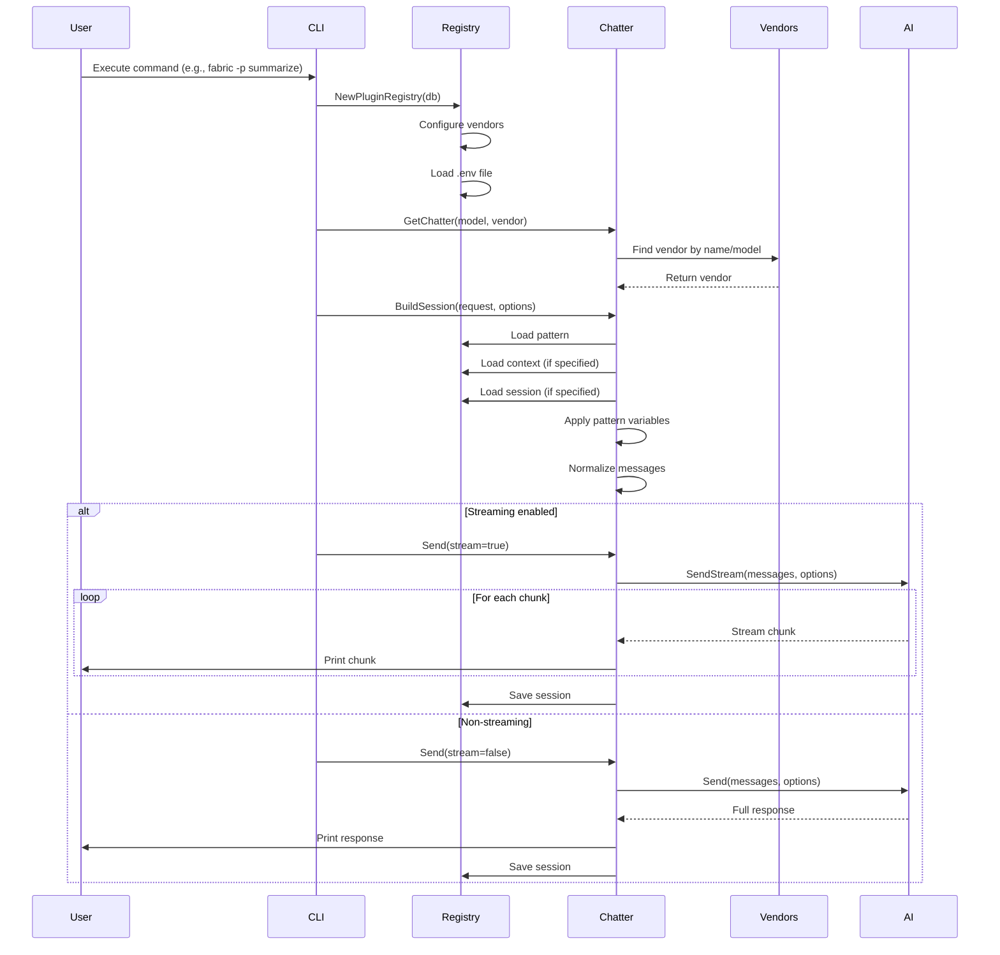

### 2. REST API Chat Flow

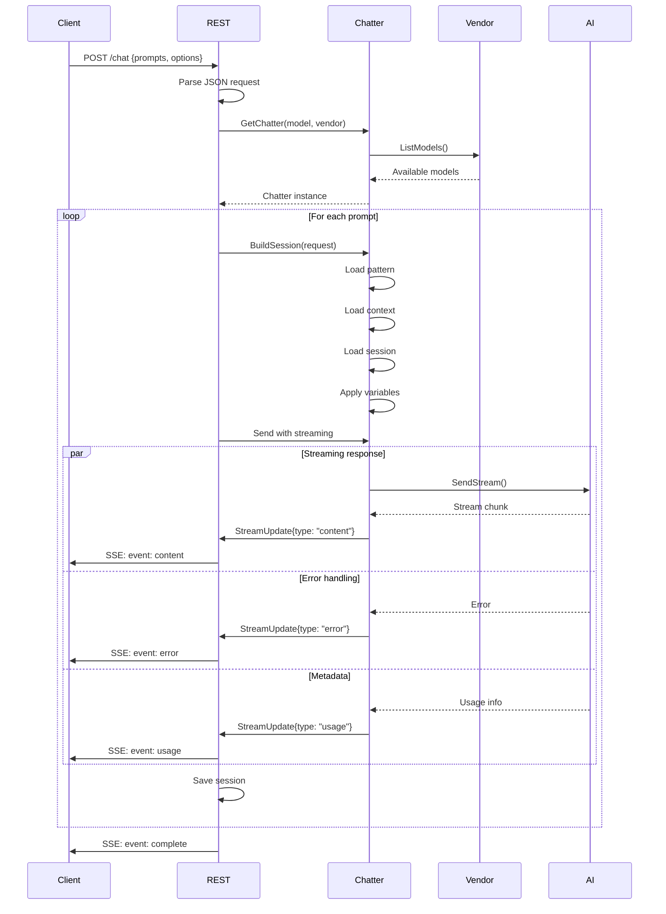

### 3. YouTube Transcript Processing Flow

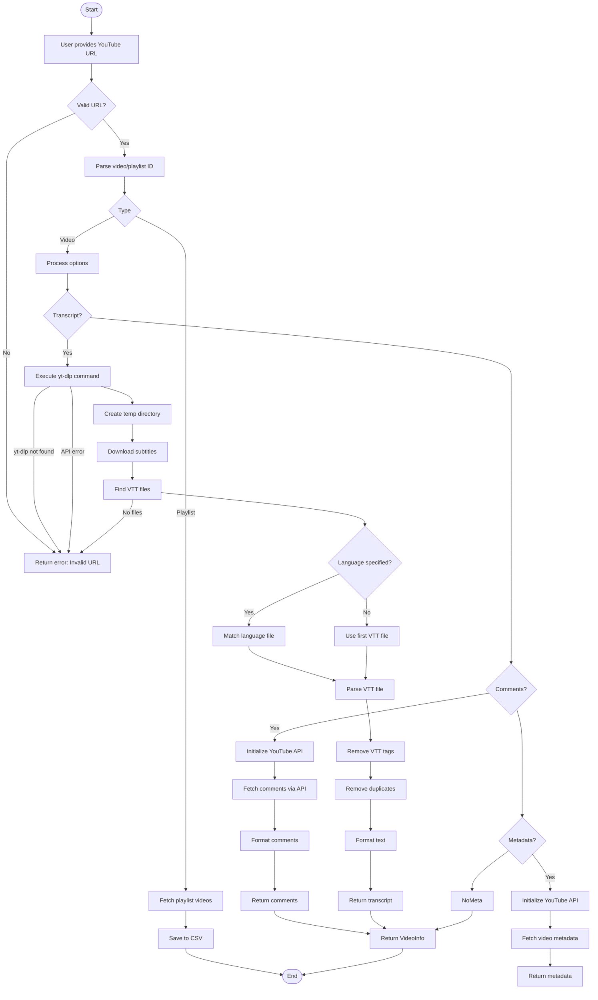

### 4. Pattern Variable Resolution Flow

```mermaid
flowchart TD
    Start([Start]) --> Load[Load pattern file]
    Load --> CheckInput{Contains input placeholder?}
    CheckInput -->|No| AddInput[Append {{input}} at end]
    CheckInput -->|Yes| Preserve[Preserve existing]
    AddInput --> ReplaceInput[Replace {{input}} with sentinel]
    Preserve --> ReplaceInput

    ReplaceInput --> Scan[Scan for template variables]
    Scan --> FoundVariables{Variables found?}
    FoundVariables -->|No| ReplaceSentinel[Replace sentinel with actual input]
    FoundVariables -->|Yes| ProcessVars

    ProcessVars --> VarLoop{For each variable}
    VarLoop --> IsExtension{Is extension call?}
    IsExtension -->|Yes| CallExt[Call extension function]
    CallExt --> VarResult[Get result]
    IsExtension -->|No| CheckEnv[Check environment variables]
    CheckEnv --> VarResult
    VarResult --> VarLoop

    VarLoop --> ReplaceSentinel
    ReplaceSentinel --> FinalPattern[Final pattern with all substitutions]
    FinalPattern --> End([End])
```

### 5. Session Management Flow

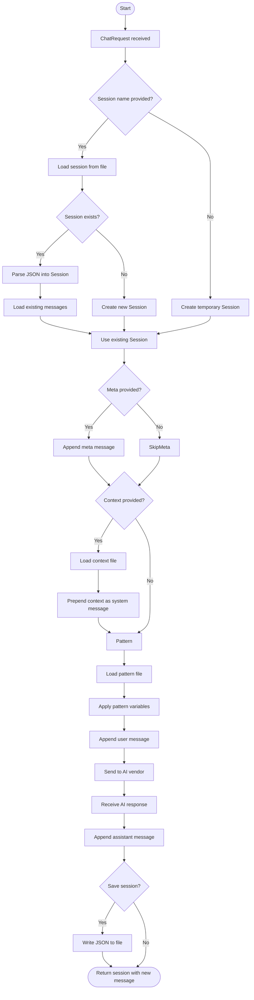

### 6. Vendor Selection and Routing Flow

```mermaid
flowchart TD
    Start([Start]) --> GetModel[Get model parameter]
    GetModel --> ModelSpecified{Model specified?}
    ModelSpecified -->|Yes| VendorName{Vendor specified?}
    ModelSpecified -->|No| UseDefault[Use default from FABRIC_DEFAULT_MODEL]
    UseDefault --> ParseDefault[Parse default vendor|model]
    ParseDefault --> Normalize[Normalize model name case-insensitive]
    Normalize --> CheckVendor

    VendorName -->|Yes| FindVendor[Find vendor by name]
    VendorName -->|No| FindByModel[Find vendor by model name]
    FindVendor --> VendorFound{Vendor found?}
    FindByModel --> ModelVendors{Vendor provides model?}

    VendorFound -->|No| Error[Error: Vendor not found]
    VendorFound -->|Yes| CheckModel
    ModelVendors -->|No| Error[Error: Model not available]
    ModelVendors -->|Yes| Multiple{Multiple vendors?}
    Multiple -->|Yes| UseFirst[Use first vendor]
    Multiple -->|No| UseSingle[Use single vendor]
    UseFirst --> CheckModel
    UseSingle --> CheckModel

    CheckModel --> ModelCheck{Model available?}
    ModelCheck -->|No| Error[Error: Model not available for vendor]
    ModelCheck -->|Yes| NeedsRaw{Needs raw mode?}
    NeedsRaw -->|Yes| SetRaw[Set raw=true]
    NeedsRaw -->|No| UseNormal[Use normal mode]
    SetRaw --> ContextLength{Model context length?}
    UseNormal --> ContextLength
    ContextLength -->|Yes| UseModel[Use specified length]
    ContextLength -->|No| UseDefaultLength[Use default length]
    UseModel --> Return([Return vendor and configuration])
    UseDefaultLength --> Return

    Error --> End([End])
    Return --> End
```

---

## Integration Mapping

### 1. AI Provider Integrations

#### Vendor Interface

```go
type Vendor interface {
    plugins.Plugin
    ListModels() ([]string, error)
    SendStream([]*chat.ChatCompletionMessage, *domain.ChatOptions, chan domain.StreamUpdate) error
    Send(context.Context, []*chat.ChatCompletionMessage, *domain.ChatOptions) (string, error)
    NeedsRawMode(modelName string) bool
}
```

#### OpenAI Provider

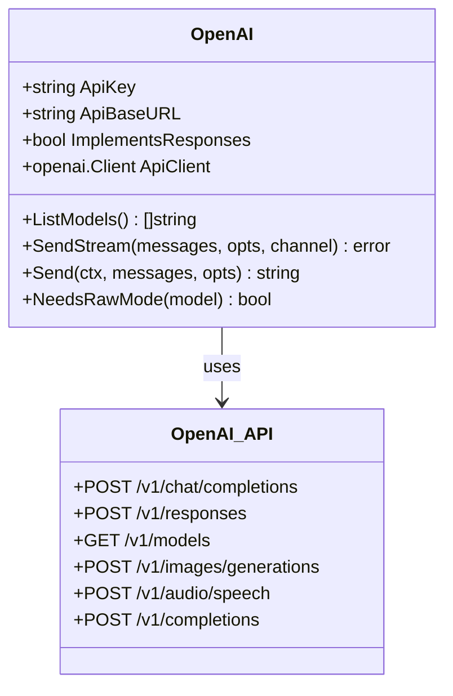

**OpenAI Integration Details:**

- **API Endpoint**: `https://api.openai.com/v1`
- **Authentication**: API key in `Authorization: Bearer sk-...` header
- **Supports**: Chat completions, Responses API, image generation, TTS
- **Features**: Web search, tools, function calling, streaming

**Key Request Flow:**
```go
// Build request
req := openai.ChatCompletionNewParams{
    Messages:        convertMessages(msgs),
    Model:           openai.F(opts.Model),
    Temperature:     openai.F(opts.Temperature),
    TopP:            openai.F(opts.TopP),
    PresencePenalty:  openai.F(opts.PresencePenalty),
    FrequencyPenalty: openai.F(opts.FrequencyPenalty),
    Stream:          openai.F(true),
}

// Stream responses
stream := client.Chat.Completions.NewStreaming(ctx, req)
for stream.Next() {
    event := stream.Current()
    switch event.Type {
    case string(constant.ChatCompletionChunkDelta("").Default()):
        channel <- StreamUpdate{
            Type:    StreamTypeContent,
            Content: event.AsChatCompletionChunkDelta().Delta.Content,
        }
    }
}
```

#### Anthropic Provider

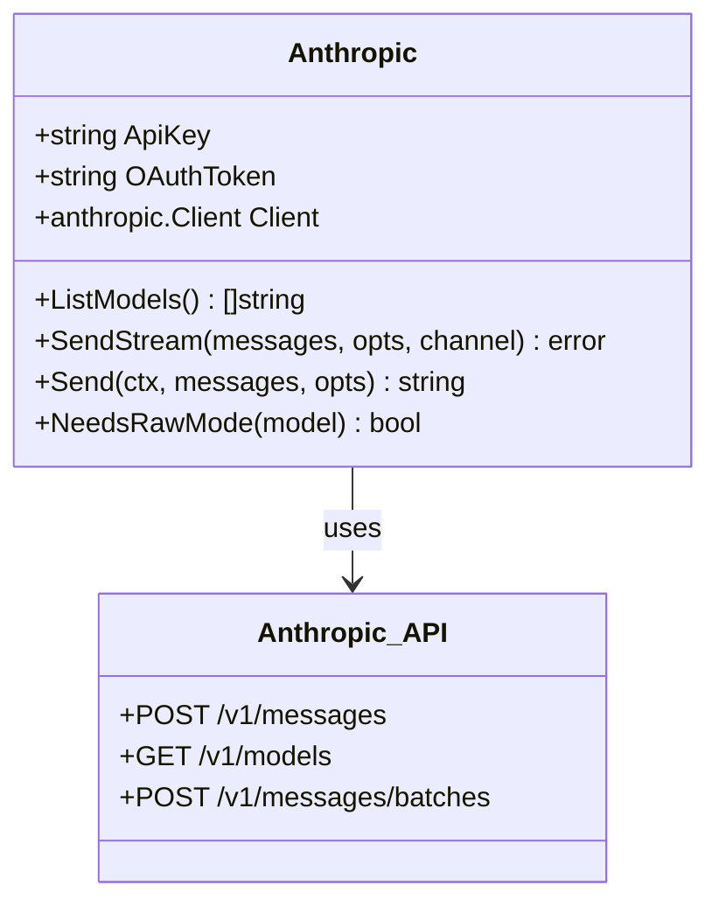

**Anthropic Integration Details:**

- **API Endpoint**: `https://api.anthropic.com/v1`
- **Authentication**: API key or OAuth token
- **Supports**: Messages API, extended thinking
- **Features**: Web search, tools, beta features

#### Google Gemini Provider

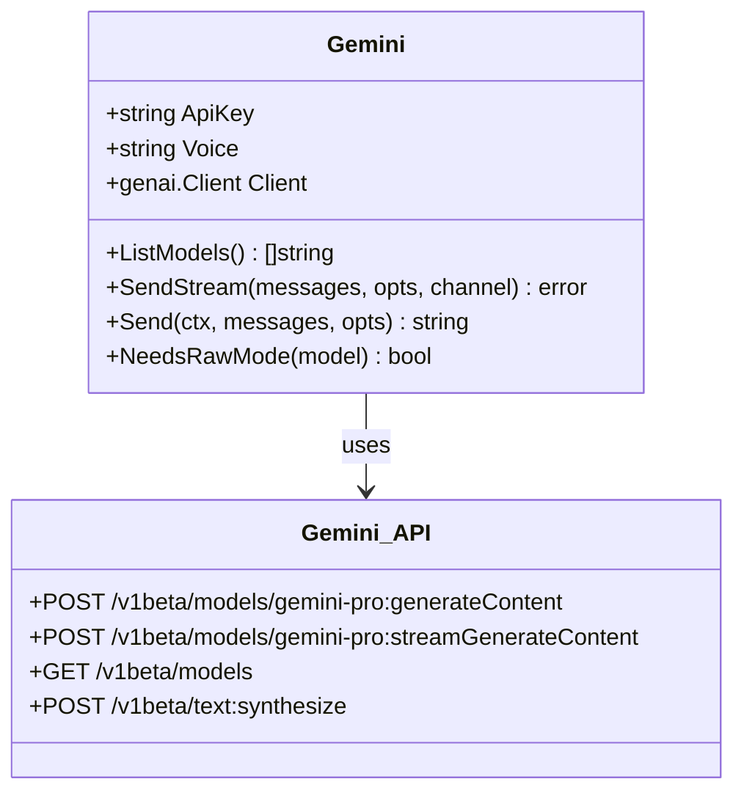

### 2. YouTube Integration

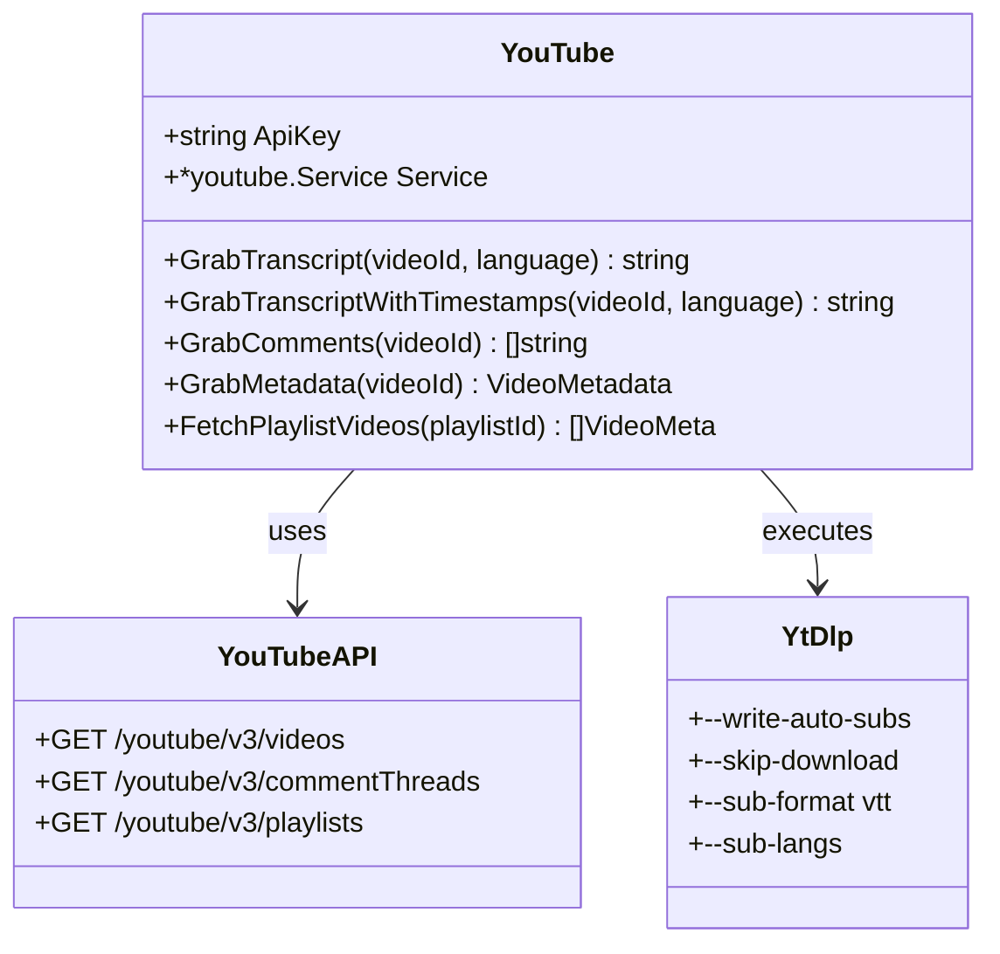

**YouTube Flow with yt-dlp:**

```bash
# Command executed
yt-dlp \
  --write-auto-subs \
  --skip-download \
  --sub-format vtt \
  --sub-langs en,en-US,en \
  -o "/tmp/fabric-youtube-VIDEOID/%(title)s.%(ext)s" \
  https://www.youtube.com/watch?v=VIDEOID

# Output files in temp directory
/tmp/fabric-youtube-VIDEOID/
  ├── Video Title.en.vtt        # Subtitle file
  └── Video Title.en-US.vtt     # Alternative language
```

**VTT Parsing Process:**

```go
// Read VTT file
content := os.ReadFile(vttFile)

// Parse lines
lines := strings.Split(content, "\n")

for line in lines {
    // Skip VTT header
    if line == "WEBVTT" { continue }

    // Skip timestamps
    if strings.Contains(line, "-->") { continue }

    // Remove formatting tags
    line = vttTagRegex.ReplaceAllString(line, "")

    // Deduplicate segments
    if !seen[line] {
        output += line + " "
        seen[line] = true
    }
}
```

### 3. Jina AI Integration

```mermaid
classDiagram
    class Jina {
        +string ApiKey
        +ScrapeURL(url) string
        +ScrapeQuestion(question) string
        +request(requestURL) string
    }

    class JinaAPI {
        +GET https://r.jina.ai/{url}
        +GET https://s.jina.ai/{question}
    }

    Jina --> JinaAPI : requests
```

**Jina API Usage:**

```go
// Webpage scraping
func (jc *Jina) ScrapeURL(url string) string {
    req, _ := http.NewRequest("GET", fmt.Sprintf("https://r.jina.ai/%s", url), nil)
    if jc.ApiKey != "" {
        req.Header.Set("Authorization", "Bearer " + jc.ApiKey)
    }
    resp, _ := client.Do(req)
    defer resp.Body.Close()
    body, _ := io.ReadAll(resp.Body)
    return string(body)
}

// Question answering
func (jc *Jina) ScrapeQuestion(question string) string {
    return jc.request(fmt.Sprintf("https://s.jina.ai/%s", question))
}
```

---

## REST API Documentation

### API Endpoint Overview

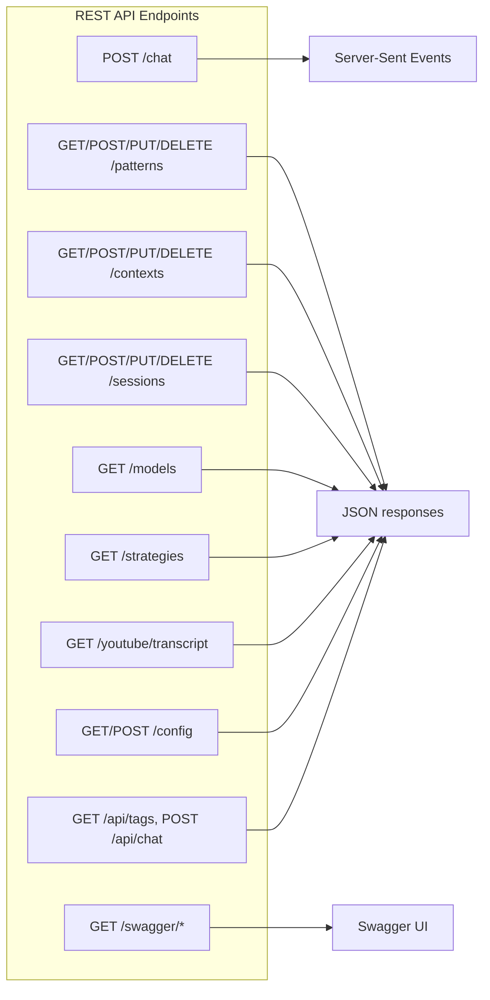

### Complete API Specification

#### 1. Chat Completion Endpoint

```http
POST /chat
Content-Type: application/json
Authorization: X-API-Key (optional)

Request Body:
{
  "prompts": [
    {
      "userInput": "Summarize this text",
      "vendor": "OpenAI",
      "model": "gpt-4",
      "patternName": "summarize",
      "contextName": "my_context",
      "sessionName": "my_session",
      "strategyName": "cot",
      "variables": {
        "#role": "expert",
        "#points": "30"
      }
    }
  ],
  "language": "en",
  "temperature": 0.7,
  "topP": 0.9,
  "presencePenalty": 0.0,
  "frequencyPenalty": 0.0,
  "stream": true,
  "thinking": "medium",
  "search": false,
  "suppressThink": false,
  "showMetadata": false
}

Response (Server-Sent Events):
event: content
data: {"type":"content","content":"Hello"}

event: usage
data: {"type":"usage","usage":{"inputTokens":100,"outputTokens":50,"totalTokens":150}}

event: complete
data: {"type":"complete"}
```

#### 2. Pattern Management Endpoints

```http
# List all patterns
GET /patterns
Response: 200 OK
["pattern1", "pattern2", "pattern3"]

# Get specific pattern
GET /patterns/{patternName}
Response: 200 OK
{
  "name": "summarize",
  "description": "Summarize text",
  "pattern": "Summarize the following: {{input}}"
}

# Create pattern
POST /patterns
Content-Type: application/json
{
  "name": "my_pattern",
  "pattern": "Custom pattern with {{input}}",
  "description": "My custom pattern"
}
Response: 201 Created

# Update pattern
PUT /patterns/{patternName}
Content-Type: application/json
{
  "pattern": "Updated pattern content",
  "description": "Updated description"
}
Response: 200 OK

# Delete pattern
DELETE /patterns/{patternName}
Response: 204 No Content
```

#### 3. Context Management Endpoints

```http
# List all contexts
GET /contexts
Response: 200 OK
["context1", "context2"]

# Get context
GET /contexts/{contextName}
Response: 200 OK
{
  "name": "my_context",
  "content": "This is my context..."
}

# Create context
POST /contexts
Content-Type: application/json
{
  "name": "my_context",
  "content": "Context content"
}
Response: 201 Created

# Update context
PUT /contexts/{contextName}
Content-Type: application/json
{
  "content": "Updated content"
}
Response: 200 OK

# Delete context
DELETE /contexts/{contextName}
Response: 204 No Content
```

#### 4. Session Management Endpoints

```http
# List all sessions
GET /sessions
Response: 200 OK
["session1", "session2"]

# Get session
GET /sessions/{sessionName}
Response: 200 OK
{
  "name": "my_session",
  "messages": [
    {
      "role": "system",
      "content": "You are a helpful assistant..."
    },
    {
      "role": "user",
      "content": "Hello"
    },
    {
      "role": "assistant",
      "content": "Hi! How can I help?"
    }
  ]
}

# Create session (implicit via chat)
POST /sessions
Content-Type: application/json
{
  "name": "my_session"
}
Response: 201 Created

# Update session
PUT /sessions/{sessionName}
Content-Type: application/json
{
  "messages": [...]
}
Response: 200 OK

# Delete session
DELETE /sessions/{sessionName}
Response: 204 No Content

# Clear session
DELETE /sessions/{sessionName}/clear
Response: 204 No Content
```

#### 5. Models Endpoint

```http
# List available models
GET /models
Response: 200 OK
{
  "OpenAI": ["gpt-4", "gpt-3.5-turbo", "gpt-4-turbo"],
  "Anthropic": ["claude-3-5-sonnet-20241022", "claude-3-opus-20240229"],
  "Gemini": ["gemini-pro", "gemini-1.5-pro"],
  "Ollama": ["llama2", "mistral", "codellama"],
  "Azure OpenAI": ["gpt-35-turbo", "gpt-4"],
  "Bedrock": ["anthropic.claude-3-sonnet-20240229-v1:0"],
  "Vertex AI": ["gemini-pro", "gemini-1.5-pro"],
  "Perplexity": ["pplx-7b-online", "pplx-70b-online"]
}
```

#### 6. Strategies Endpoint

```http
# List all strategies
GET /strategies
Response: 200 OK
{
  "cot": {
    "name": "Chain-of-Thought",
    "prompt": "Let's think step by step...\n\n{prompt}"
  },
  "cod": {
    "name": "Chain-of-Draft",
    "prompt": "Draft with minimal notes...\n\n{prompt}"
  }
}
```

#### 7. YouTube Endpoint

```http
# Get transcript
GET /youtube/transcript?url=https://youtube.com/watch?v=VIDEOID&transcript=true&comments=false&metadata=false
Response: 200 OK
{
  "transcript": "This is the transcript...",
  "duration": 600,
  "comments": [],
  "metadata": null
}

# Get with options
GET /youtube/transcript?url=...&transcript=true&comments=true&metadata=true
Response: 200 OK
{
  "transcript": "...",
  "duration": 600,
  "comments": ["Comment 1", "Comment 2"],
  "metadata": {
    "id": "VIDEOID",
    "title": "Video Title",
    "description": "Video description...",
    "publishedAt": "2024-01-01T00:00:00Z",
    "channelTitle": "Channel Name",
    "viewCount": 1000000,
    "likeCount": 50000
  }
}
```

#### 8. Configuration Endpoint

```http
# Get configuration
GET /config
Response: 200 OK
{
  "defaults": {
    "model": "OpenAI|gpt-4",
    "vendor": "OpenAI"
  },
  "patterns": {
    "patternsLoader": {
      "githubRepo": "danielmiessler/fabric",
      "githubBranch": "main"
    }
  },
  "vendors": {
    "OpenAI": {
      "configured": true,
      "apiKey": "sk-***"
    }
  }
}

# Update configuration
POST /config
Content-Type: application/json
{
  "vendor": "OpenAI",
  "apiKey": "sk-new-key",
  "defaultModel": "OpenAI|gpt-4"
}
Response: 200 OK
```

#### 9. Ollama Compatibility Endpoints

```http
# List models (Ollama format)
GET /api/tags
Response: 200 OK
{
  "models": [
    {
      "name": "summarize",
      "modified_at": "2024-01-01T00:00:00Z",
      "size": 1000000
    },
    {
      "name": "analyze_claims",
      "modified_at": "2024-01-01T00:00:00Z",
      "size": 1000000
    }
  ]
}

# Chat completion (Ollama format)
POST /api/chat
Content-Type: application/json
{
  "model": "summarize",
  "stream": true,
  "messages": [
    {
      "role": "user",
      "content": "Summarize this text"
    }
  ]
}
Response: 200 OK (streaming)
{"model":"summarize","message":{"role":"assistant","content":"Here's a summary..."}}
```

---

## Complete Code Models

### Plugin Interface

```go
package plugins

type Plugin interface {
    GetName() string
    GetSetupDescription() string
    IsConfigured() bool
    Setup() error
    SetupFillEnvFileContent(*bytes.Buffer)
}

type VendorPlugin interface {
    Plugin
    ListModels() ([]string, error)
    SendStream([]*chat.ChatCompletionMessage, *domain.ChatOptions, chan domain.StreamUpdate) error
    Send(context.Context, []*chat.ChatCompletionMessage, *domain.ChatOptions) (string, error)
    NeedsRawMode(modelName string) bool
}

type PluginBase struct {
    Name             string
    SetupDescription string
    EnvNamePrefix    string
    SetupQuestions   []*SetupQuestion
}

type SetupQuestion struct {
    Question      string
    Value         string
    IsRequired    bool
    IsHidden      bool
    DefaultValue string
}

func (pb *PluginBase) AddSetupQuestion(question string, isRequired bool) *SetupQuestion {
    envVar := pb.EnvNamePrefix + "_" + strings.ToUpper(strings.ReplaceAll(question, " ", "_"))
    sq := &SetupQuestion{
        Question:   question,
        EnvVar:    envVar,
        IsRequired: isRequired,
        Value:      os.Getenv(envVar),
    }
    pb.SetupQuestions = append(pb.SetupQuestions, sq)
    return sq
}

func (pb *PluginBase) IsConfigured() bool {
    for _, sq := range pb.SetupQuestions {
        if sq.IsRequired && sq.Value == "" {
            return false
        }
    }
    return true
}
```

### Storage Entity Implementation

```go
package fsdb

type StorageEntity struct {
    Label         string
    Dir           string
    ItemIsDir     bool
    FileExtension string
}

func (o *StorageEntity) Configure() error {
    return os.MkdirAll(o.Dir, os.ModePerm)
}

func (o *StorageEntity) GetNames() ([]string, error) {
    absDir, err := util.GetAbsolutePath(o.Dir)
    if err != nil {
        return nil, fmt.Errorf("could not resolve directory path: %v", err)
    }

    entries, err := os.ReadDir(absDir)
    if err != nil {
        return nil, fmt.Errorf("could not read items from directory: %v", err)
    }

    var names []string
    for _, entry := range entries {
        entryPath := filepath.Join(absDir, entry.Name())
        fileInfo, err := os.Lstat(entryPath)
        if err != nil {
            return nil, fmt.Errorf("could not stat entry %s: %v", entryPath, err)
        }

        if o.ItemIsDir {
            if fileInfo.IsDir() || (fileInfo.Mode()&os.ModeSymlink != 0 && util.IsSymlinkToDir(entryPath)) {
                names = append(names, entry.Name())
            }
        } else {
            if !fileInfo.IsDir() {
                if o.FileExtension == "" || filepath.Ext(entry.Name()) == o.FileExtension {
                    names = append(names, strings.TrimSuffix(entry.Name(), o.FileExtension))
                }
            }
        }
    }

    return names, nil
}

func (o *StorageEntity) Save(name string, content []byte) error {
    err := os.WriteFile(o.BuildFilePathByName(name), content, 0644)
    if err != nil {
        return fmt.Errorf("could not save %s: %v", name, err)
    }
    return nil
}

func (o *StorageEntity) Load(name string) ([]byte, error) {
    content, err := os.ReadFile(o.BuildFilePathByName(name))
    if err != nil {
        return nil, fmt.Errorf("could not load %s: %v", name, err)
    }
    return content, nil
}

func (o *StorageEntity) SaveAsJson(name string, item interface{}) error {
    jsonString, err := json.Marshal(item)
    if err != nil {
        return fmt.Errorf("could not marshal %s: %s", name, err)
    }
    return o.Save(name, jsonString)
}

func (o *StorageEntity) LoadAsJson(name string, item interface{}) error {
    content, err := o.Load(name)
    if err != nil {
        return fmt.Errorf("could not load %s: %v", name, err)
    }

    if err := json.Unmarshal(content, &item); err != nil {
        return fmt.Errorf("could not unmarshal %s: %s", name, err)
    }
    return nil
}
```

### VendorsManager Implementation

```go
package ai

type VendorsManager struct {
    Vendors         []Vendor
    VendorsByName   map[string]Vendor
}

func NewVendorsManager() *VendorsManager {
    return &VendorsManager{
        Vendors:       []Vendor{},
        VendorsByName: map[string]Vendor{},
    }
}

func (o *VendorsManager) AddVendors(vendors ...Vendor) {
    for _, vendor := range vendors {
        name := vendor.GetName()
        if o.VendorsByName[name] == nil {
            o.VendorsByName[name] = vendor
            o.Vendors = append(o.Vendors, vendor)
        }
    }
}

func (o *VendorsManager) Clear() {
    o.Vendors = []Vendor{}
    o.VendorsByName = map[string]Vendor{}
}

func (o *VendorsManager) FindByName(name string) Vendor {
    return o.VendorsByName[name]
}

func (o *VendorsManager) GetModels() (*VendorsModels, error) {
    models := &VendorsModels{
        Models:        map[string]map[string]bool{},
        VendorsByItem: map[string][]string{},
    }

    for _, vendor := range o.Vendors {
        if !vendor.IsConfigured() {
            continue
        }

        vendorModels, err := vendor.ListModels()
        if err != nil {
            continue
        }

        vendorName := vendor.GetName()
        if models.Models[vendorName] == nil {
            models.Models[vendorName] = map[string]bool{}
        }

        for _, model := range vendorModels {
            models.Models[vendorName][model] = true
            models.VendorsByItem[model] = append(models.VendorsByItem[model], vendorName)
        }
    }

    if len(models.Models) == 0 {
        return nil, fmt.Errorf("no models available - please configure at least one vendor")
    }

    return models, nil
}

type VendorsModels struct {
    Models        map[string]map[string]bool  // vendor -> model -> true
    VendorsByItem map[string][]string        // model -> [vendor1, vendor2]
}

func (o *VendorsModels) FindGroupsByItem(item string) []string {
    vendors, exists := o.VendorsByItem[item]
    if !exists {
        return []string{}
    }
    return vendors
}

func (o *VendorsModels) FindGroupsByItemFirst(item string) string {
    vendors := o.FindGroupsByItem(item)
    if len(vendors) > 0 {
        return vendors[0]
    }
    return ""
}

func (o *VendorsModels) FindModelNameCaseInsensitive(modelName string) string {
    for vendor, models := range o.Models {
        for model := range models {
            if strings.EqualFold(model, modelName) {
                return model
            }
        }
    }
    return ""
}
```

### Template Extension System

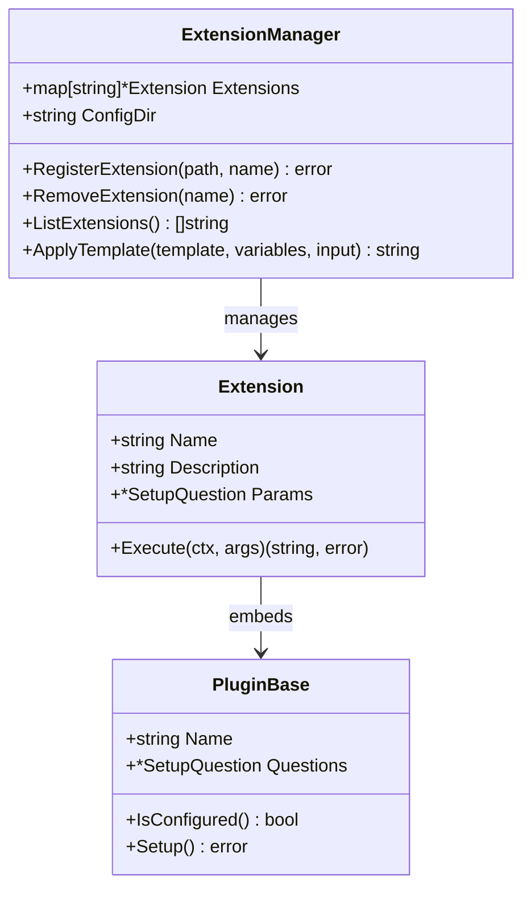

**Extension Example:**

```go
package main

import (
    "context"
    "github.com/danielmiessler/fabric/internal/plugins"
)

type DateExtension struct {
    *plugins.PluginBase
}

func NewDateExtension() *DateExtension {
    return &DateExtension{
        PluginBase: &plugins.PluginBase{
            Name:             "date",
            SetupDescription:  "Get current date",
            EnvNamePrefix:    "FABRIC_EXT_DATE",
        },
    }
}

func (e *DateExtension) Execute(ctx context.Context, args map[string]string) (string, error) {
    return time.Now().Format("2006-01-02"), nil
}
```

**Usage in Pattern:**

```markdown
# System
Today's date is {{date}}.

{{input}}
```

---

## Background Processing and State Management

### Pattern Loading Process

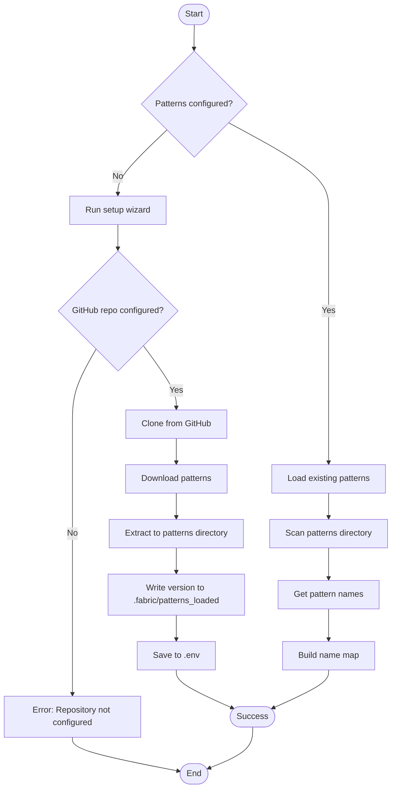

### Strategy Application Flow

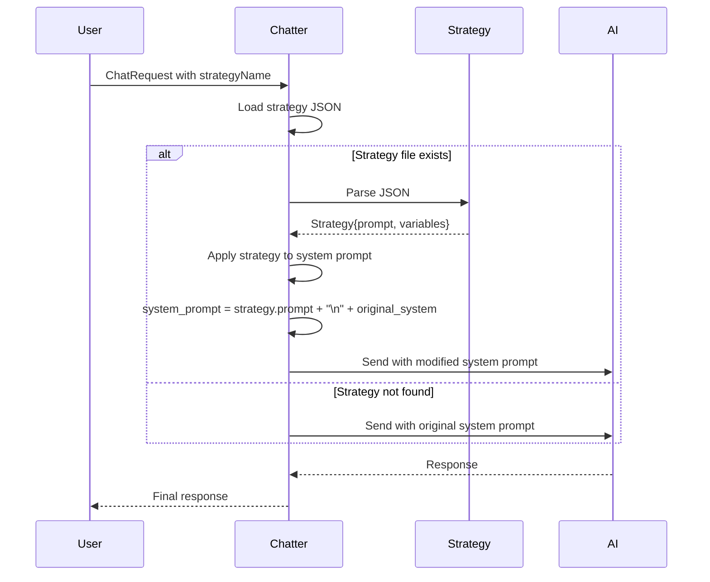

**Strategy JSON Format:**

```json
{
  "name": "Chain-of-Thought",
  "description": "Step-by-step reasoning",
  "prompt": "Let's think step by step:\n\n{prompt}"
}
```

**Strategy Types:**

| Strategy | Description | Prompt Pattern |
|----------|-------------|----------------|
| `cot` | Chain-of-Thought | Step-by-step reasoning |
| `cod` | Chain-of-Draft | Iterative drafting with minimal notes |
| `tot` | Tree-of-Thought | Generate multiple reasoning paths |
| `aot` | Atom-of-Thought | Break into atomic sub-problems |
| `ltm` | Least-to-Most | Solve from easiest to hardest |
| `self-consistent` | Self-Consistency | Multiple paths with consensus |
| `self-refine` | Self-Refinement | Answer, critique, refine |
| `reflexion` | Reflexion | Answer, brief critique, refine |
| `standard` | Standard | Direct answer without explanation |

### Session Persistence Flow

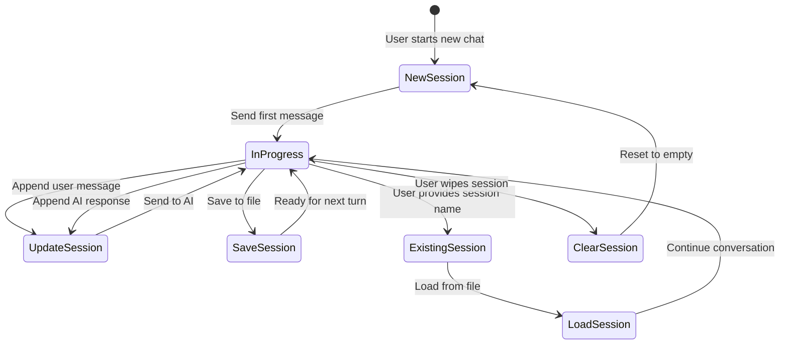

**Session JSON Format:**

```json
[
  {
    "role": "system",
    "content": "You are a helpful assistant specialized in..."
  },
  {
    "role": "meta",
    "content": "Session metadata..."
  },
  {
    "role": "user",
    "content": "What is quantum computing?"
  },
  {
    "role": "assistant",
    "content": "Quantum computing is..."
  },
  {
    "role": "user",
    "content": "Explain qubits"
  },
  {
    "role": "assistant",
    "content": "Qubits are..."
  }
]
```

---

## Performance and Security Considerations

### Performance Optimization

1. **Streaming Responses**: All AI providers support streaming for immediate user feedback
2. **Connection Reuse**: HTTP clients are reused across requests
3. **File Caching**: Patterns and contexts loaded from disk are cached in memory
4. **Concurrent Processing**: Multiple prompts can be processed in parallel via REST API
5. **Efficient VTT Parsing**: Regex-based VTT tag removal and deduplication

### Security Features

1. **API Key Management**: Keys stored in .env file, not committed to version control
2. **API Key Authentication**: REST API supports optional X-API-Key header
3. **Environment Variable Isolation**: Each vendor uses prefixed environment variables
4. **Input Validation**: All URLs and file paths validated before processing
5. **Command Injection Prevention**: yt-dlp arguments sanitized via shellquote
6. **Content Type Validation**: Attachments validated via MIME type detection

### Error Handling

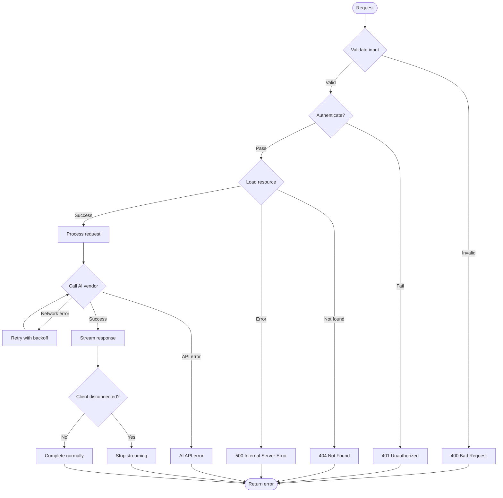

**Retry Logic:**

- Network errors: Retry up to 3 times with exponential backoff
- YouTube API rate limiting: Retry with different language options
- yt-dlp errors: Fallback to language-independent subtitle fetch

---

## Conclusion

Fabric is a sophisticated AI augmentation framework with a plugin-based architecture that supports:

- **Multiple AI Providers**: 8+ native integrations with 15+ OpenAI-compatible providers
- **Flexible Pattern System**: File-based patterns with template variables and extensions
- **Context and Session Management**: Persistent conversation state via JSON files
- **External Integrations**: YouTube, Jina AI, Git helpers for data ingestion
- **REST API**: Full HTTP API with SSE streaming and Ollama compatibility
- **Extensibility**: Plugin system for custom AI vendors, tools, and template extensions

The architecture prioritizes simplicity (file-based storage), flexibility (multiple providers and patterns), and extensibility (plugin system) while maintaining performance through streaming and caching.

---

*Document Version: 1.0*
*Generated: January 2026*
*Fabric Version: Latest (Go implementation)*
